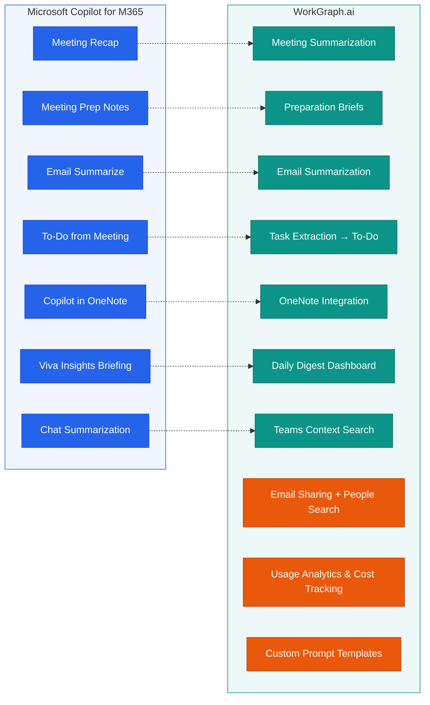
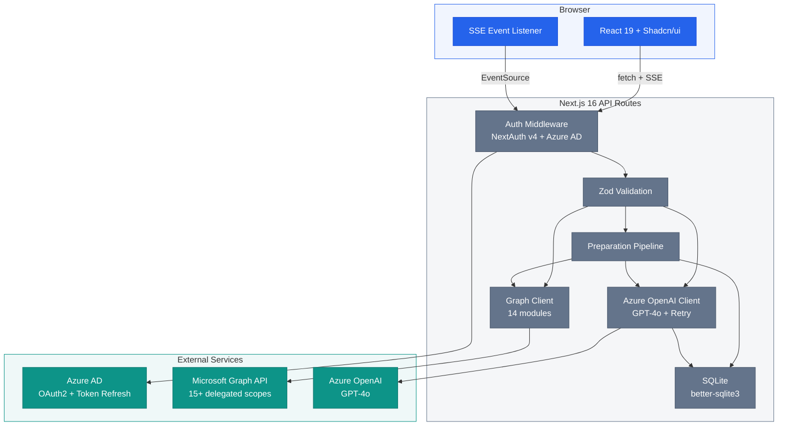
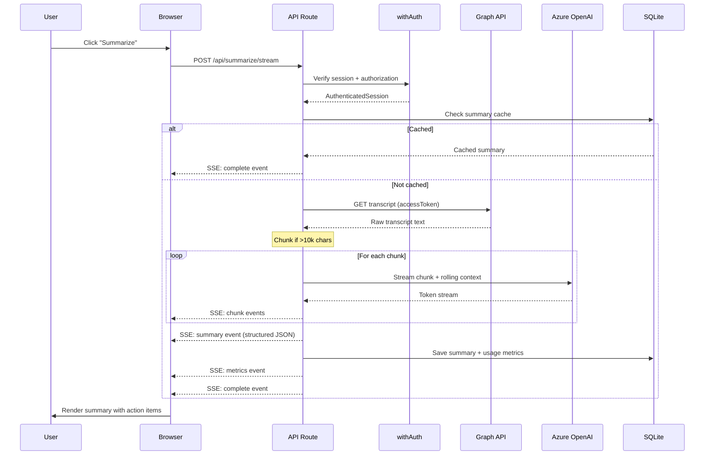
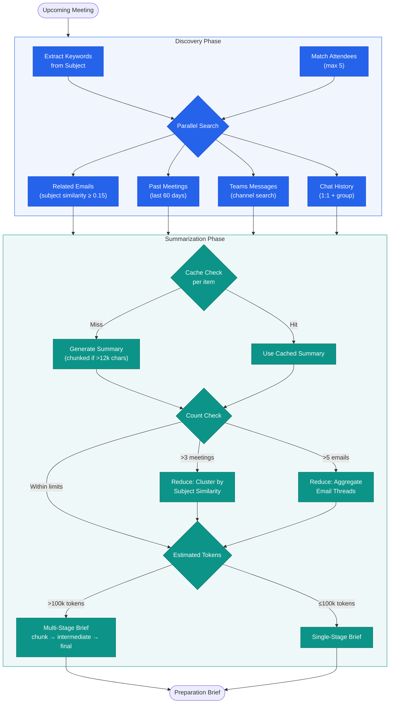
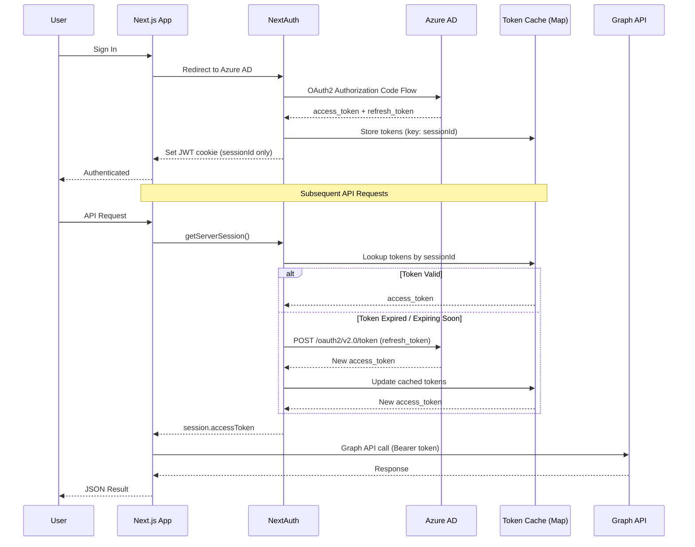
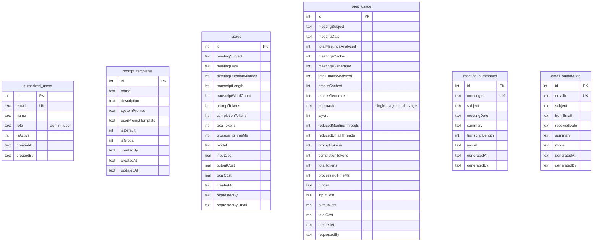
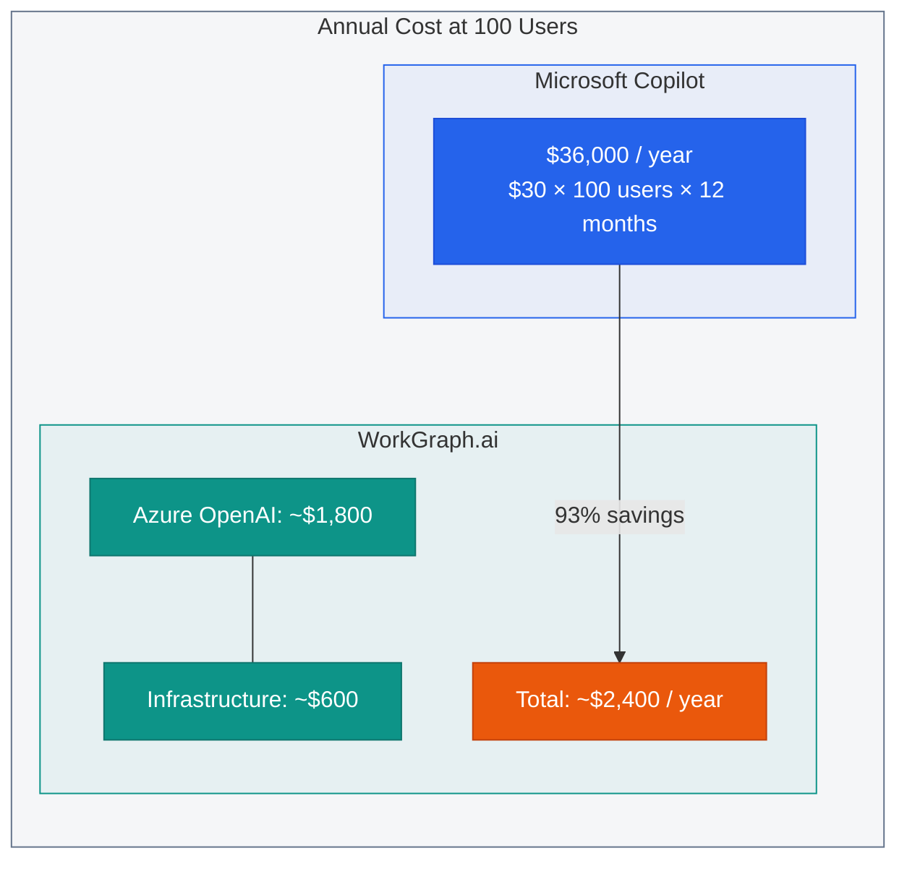

## The $30/User/Month Question

Microsoft Copilot for Microsoft 365 costs **$30 per user per month** --- $360 per user per year. For a 500-person organization, that's **$180,000 annually**. For what? Meeting recaps, email summaries, task extraction, and daily briefings.

Not every team needs Copilot's full breadth of features. Many knowledge workers only need the **meeting intelligence** slice: summarize what happened, extract action items, prepare for the next meeting, and surface what matters from the inbox. If that describes your team, you're paying for Word/Excel/PowerPoint AI features nobody asked for.

Here's the thing most people don't realize: **Copilot for M365 is built on the same Microsoft Graph API and Azure OpenAI that any developer can access today.** The delegated permissions Copilot uses --- `Calendars.Read`, `Mail.Read`, `OnlineMeetingTranscript.Read.All` --- are available to any Azure AD application. The LLM behind it? GPT-4o, deployed on Azure OpenAI, priced by the token.

**What if you could build the 80% of Copilot your team actually uses --- at 3-7% of the cost?**

That's what [WorkGraph.ai](https://github.com/nitin27may/workgraph.ai) does. It's an open-source, self-hosted meeting intelligence platform built with Next.js 16, Microsoft Graph API, and Azure OpenAI. This article is a deep-dive into how it works, why it works, and how you can deploy it for your team.

> **Key insight:** Copilot for M365 and WorkGraph.ai share the same foundation --- delegated Microsoft Graph API scopes and Azure OpenAI GPT-4o. The difference is packaging, pricing, and control.
{: .prompt-info }

---

## What WorkGraph.ai Does --- Feature Overview

WorkGraph.ai isn't a toy demo. It's a production-grade application with 11 distinct features, each mapping to (or exceeding) a Copilot capability. Let's walk through each one.

### Meeting Summarization

**Copilot equivalent:** Meeting Recap

The core feature. WorkGraph.ai fetches meeting transcripts from Microsoft Graph, processes them through a chunked MapReduce pipeline (more on that in [Section 3.4](#mapreduce-for-long-transcripts)), and produces structured JSON summaries with key decisions, action items with owners and deadlines, metrics mentioned, and next steps.

What makes this different from a naive "paste transcript into ChatGPT" approach:

- **Chunked processing** with 600-character overlap windows to prevent context loss at chunk boundaries
- **Streaming SSE** responses so users see results in real-time, not after a 30-second wait
- **Permanent caching** --- summarize once, retrieve instantly forever
- **Usage tracking** with per-request cost calculation

The output follows a strict TypeScript interface:

```typescript
interface MeetingSummary {
  subject: string;
  date: string;
  keyDecisions: string[];
  actionItems: Array<{
    owner: string;
    task: string;
    deadline?: string;
  }>;
  metrics: string[];
  nextSteps: string[];
  fullSummary: string;
}
```

<!-- screenshot: Meetings list with inline summary -->

### Meeting Preparation Briefs

**Copilot equivalent:** Meeting Prep Notes

Before any meeting, WorkGraph.ai runs a **two-stage intelligence pipeline** that:

1. **Discovery:** Extracts keywords from the upcoming meeting's subject and attendees, then searches across emails, past meetings, Teams chats, and files for related context using Jaccard similarity matching
2. **Summarization:** Processes all discovered context (with caching to avoid re-summarizing known content), reduces threads when counts exceed thresholds, and generates a comprehensive preparation brief

The result is a single document that tells you: what was discussed previously, what decisions were made, what's still open, and what each attendee's recent involvement looks like. This is arguably the highest-value feature --- it turns 30 minutes of pre-meeting scrambling into a 2-minute read.

<!-- screenshot: Meeting preparation brief with context sources -->

### Email Summarization

**Copilot equivalent:** Copilot Email Summarize

Extracts key points, action items, and sentiment from email threads. Useful for long email chains where you need the bottom line without reading 47 replies. Summaries are cached permanently by email ID.

### Task & Action Item Extraction to Microsoft To-Do

**Copilot equivalent:** Copilot To-Do from Meeting

After generating a meeting summary, action items can be pushed directly to Microsoft To-Do via the Graph API (`Tasks.ReadWrite` scope). Each task includes the owner, description, and deadline extracted from the transcript. No more copying items from meeting notes into your task manager.

### OneNote Integration

**Copilot equivalent:** Copilot in OneNote

Meeting summaries and action items can be saved as structured OneNote pages. The integration creates formatted pages with sections for decisions, action items, metrics, and next steps --- not just a raw text dump.

<!-- screenshot: OneNote save dialog -->

### Daily Digest Dashboard

**Copilot equivalent:** Viva Insights Daily Briefing

A morning intelligence center that aggregates:
- Today's meetings with preparation status
- Unread important emails
- Overdue and due-today tasks
- Flagged emails requiring attention
- Action items from recent meetings

This replaces the "check five different apps to start your day" workflow with a single dashboard.

<!-- screenshot: Daily digest dashboard -->

### Teams Channel Context Search

**Copilot equivalent:** Copilot Chat Summarization

Search across Teams channels for messages related to a topic. Useful for finding prior discussions, decisions, or shared files that were mentioned in a channel but never made it into formal documentation.

### Email Sharing with People Search

**Copilot equivalent:** N/A (unique to WorkGraph.ai)

Share meeting summaries and preparation briefs via email, with a built-in people search powered by the Graph API's `People.Read` scope. The people API returns contacts ranked by relevance to the current user, making it fast to find the right recipients.

### Usage Analytics & Cost Tracking

**Copilot equivalent:** N/A (unique to WorkGraph.ai)

Every AI operation is tracked: token counts, processing time, cost per request, model used, and who requested it. This gives administrators full visibility into actual AI spend --- something Copilot's flat per-user pricing intentionally obscures.

<!-- screenshot: Usage analytics page -->

### Custom Prompt Templates

**Copilot equivalent:** N/A (Copilot prompts are locked)

Administrators can create and manage prompt templates that control how meetings are summarized. Want a template optimized for engineering standups? Sales calls? Board meetings? Create it, set it as default for specific users, and iterate. Copilot gives you zero control over its prompts.

### Admin User Management

**Copilot equivalent:** N/A (enterprise admin)

Database-driven user allowlist with role-based access (admin/user). Every API route checks authorization before processing. The admin can add/remove users and view usage across the organization.

<!-- screenshot: Admin user management -->

### Feature Comparison Matrix



The three orange nodes --- Email Sharing, Usage Analytics, and Custom Prompt Templates --- have **no Copilot equivalent**. These are features that only make sense when you control the platform.

---

## Architecture Deep-Dive

### High-Level System Architecture

WorkGraph.ai is a **Next.js 16 App Router monolith**. There is no separate backend service. All server logic runs as API route handlers inside the Next.js application. The client is React 19 with Shadcn/ui components, using `"use client"` directives with `useState` and `fetch` for data loading.

This architecture choice is intentional: a single deployment unit that can run in Docker, on a VM, or on any Node.js host. No microservices, no message queues, no Kubernetes required.



The data flow is straightforward: **Browser → API Route (auth + validation) → Microsoft Graph / Azure OpenAI → SQLite cache → JSON response**. Every API route follows the same pattern:

1. `withAuth` checks the session and user authorization
2. Zod schema validates the request body
3. Business logic calls Graph API and/or Azure OpenAI
4. Results are cached in SQLite and returned as JSON

### Request Flow --- Meeting Summarization

The summarization flow is the most instructive because it demonstrates streaming, chunking, caching, and metrics tracking in a single request:



Key details:
- The **SSE (Server-Sent Events)** protocol allows streaming partial results to the browser as they arrive from Azure OpenAI, rather than waiting for the full response
- **Rolling context** carries forward a condensed summary from previous chunks so later chunks have awareness of earlier content
- **Usage metrics** (tokens, cost, processing time) are saved to SQLite after each request

### Meeting Preparation Pipeline

The preparation pipeline is the most architecturally complex feature. It orchestrates parallel searches across four data sources, intelligently caches intermediate results, and uses an adaptive reduce strategy for large contexts.



The configuration constants that drive this pipeline:

```typescript
const SIMILARITY_THRESHOLD = 0.15;   // Jaccard similarity for subject matching
const MAX_RELATED_EMAILS = 15;       // Cap on email results per search
const MAX_RELATED_MEETINGS = 8;      // Cap on related meetings
const MAX_PREP_ATTENDEES = 5;        // Max attendees to search for
const PREP_DAYS_BACK = 60;           // How far back to search
```

The Jaccard similarity function compares keyword sets between meeting subjects:

```typescript
function getSubjectSimilarity(subject1: string, subject2: string): number {
  const keywords1 = extractKeywords(subject1);
  const keywords2 = extractKeywords(subject2);
  if (keywords1.size === 0 || keywords2.size === 0) return 0;
  const intersection = new Set([...keywords1].filter(k => keywords2.has(k)));
  const union = new Set([...keywords1, ...keywords2]);
  return intersection.size / union.size;
}
```

### MapReduce for Long Transcripts

A one-hour meeting transcript can easily reach 20,000-40,000 characters. Sending this to GPT-4o in a single prompt causes two problems:

1. **Context dilution** --- the model loses track of details mentioned early in the transcript
2. **Token cost** --- you're paying for massive prompts when most of the content is filler ("um", "uh", "can you hear me?")

WorkGraph.ai solves this with a **chunked MapReduce** approach:

```mermaid
flowchart LR
    T["Long Transcript<br/>~30,000 chars"]:::input --> SPLIT["Split into Chunks<br/>10,000 chars each<br/>600 char overlap"]:::process

    SPLIT --> C1["Chunk 1"]:::chunk
    SPLIT --> C2["Chunk 2"]:::chunk
    SPLIT --> C3["Chunk 3"]:::chunk

    C1 -->|"Summarize"| S1["Summary 1<br/>(rolling context)"]:::summary
    S1 -->|"Context passed<br/>to next chunk"| C2
    C2 -->|"Summarize<br/>with context"| S2["Summary 2<br/>(rolling context)"]:::summary
    S2 -->|"Context passed<br/>to next chunk"| C3
    C3 -->|"Final chunk<br/>+ all context"| FINAL["Structured JSON<br/>Summary"]:::output

    classDef input fill:#64748B,stroke:#475569,color:#fff
    classDef process fill:#2563EB,stroke:#1d4ed8,color:#fff
    classDef chunk fill:#2563EB,stroke:#1d4ed8,color:#fff
    classDef summary fill:#0D9488,stroke:#0f766e,color:#fff
    classDef output fill:#EA580C,stroke:#c2410c,color:#fff
```



The chunking implementation:

```typescript
const TRANSCRIPT_CHUNK_SIZE = 10000; // chars — ~2500 tokens

function chunkTranscript(transcript: string): string[] {
  if (transcript.length <= TRANSCRIPT_CHUNK_SIZE) return [transcript];

  const chunks: string[] = [];
  const overlap = 600; // retain last 600 chars for continuity
  let start = 0;

  while (start < transcript.length) {
    const end = Math.min(start + TRANSCRIPT_CHUNK_SIZE, transcript.length);
    chunks.push(transcript.slice(start, end));
    if (end === transcript.length) break;
    start = end - overlap;
  }

  return chunks;
}
```

The 600-character overlap is critical. Without it, a decision or action item that spans a chunk boundary would be split across two summaries and potentially lost. The overlap ensures that boundary content appears in both chunks, and the rolling context deduplicates during aggregation.

### Authentication Flow

WorkGraph.ai uses **NextAuth v4 with Azure AD** and 15+ delegated Graph scopes. The authentication architecture has one important design decision: **access tokens are NOT stored in cookies.** Azure AD access tokens can be 2-3KB, which exceeds cookie size limits in many browsers. Instead:

- The JWT cookie stores only a `sessionId` (32 random bytes)
- Actual tokens live in a **server-side Map** (`tokenCache`)
- The `jwt` callback refreshes tokens automatically when they expire or are within 5 minutes of expiry



The scopes requested during authentication:

| Scope | Purpose |
|-------|---------|
| `User.Read` | Current user profile |
| `User.ReadBasic.All` | Directory user lookup |
| `People.Read` | Relevance-ranked contacts |
| `Calendars.Read` | Read calendar events |
| `Calendars.ReadWrite` | Create/update events |
| `OnlineMeetings.Read` | Meeting metadata |
| `CallRecordings.Read.All` | Meeting recordings |
| `OnlineMeetingTranscript.Read.All` | Meeting transcripts |
| `Mail.Read` | Read emails |
| `Mail.ReadWrite` | Manage emails |
| `Mail.Send` | Send emails |
| `Chat.Read` | Read Teams chats |
| `ChatMessage.Send` | Send chat messages |
| `Tasks.ReadWrite` | Manage To-Do tasks |
| `Files.Read` | Read OneDrive files |

Every one of these scopes is a **delegated permission** --- the app acts on behalf of the signed-in user, never with application-level access. This is the same permission model Copilot uses.

### Database Schema

WorkGraph.ai uses SQLite (`better-sqlite3`) for all persistent storage. The schema tracks six types of data:



The `meeting_summaries` and `email_summaries` tables serve as **permanent caches** --- once a summary is generated, it's never regenerated. The `usage` and `prep_usage` tables provide the data for the analytics dashboard, tracking every token spent and every dollar calculated.

---

## Key Implementation Patterns

### The `withAuth` Higher-Order Function

Every API route in WorkGraph.ai follows the same authentication pattern. Rather than duplicating auth checks across 30+ routes, a single HOF wraps any handler:

```typescript
export function withAuth<Args extends any[]>(
  handler: (
    req: NextRequest,
    session: AuthenticatedSession,
    ...args: Args
  ) => Promise<NextResponse>
): (req: NextRequest, ...args: Args) => Promise<NextResponse> {
  return async (req: NextRequest, ...args: Args) => {
    const session = await getServerSession(authOptions);

    if (!session?.accessToken || !session?.user?.email) {
      return NextResponse.json({ error: "Unauthorized" }, { status: 401 });
    }

    const { authorized } = isUserAuthorized(session.user.email);
    if (!authorized) {
      return NextResponse.json(
        { error: "Forbidden - You are not authorized" },
        { status: 403 }
      );
    }

    return handler(req, session as AuthenticatedSession, ...args);
  };
}
```

Usage in a route file is a one-liner:

```typescript
// src/app/api/meetings/route.ts
export const GET = withAuth(async (req, session) => {
  const meetings = await getUserMeetings(session.accessToken);
  return NextResponse.json(meetings);
});
```

The generic `...args` spread preserves Next.js dynamic route params (e.g., `{ params: { id: string } }`) without type loss.

### Streaming SSE with ReadableStream

The summarization endpoint uses the Web Streams API to send events as they arrive from Azure OpenAI:

```typescript
function encodeSSE(event: string, data: unknown): string {
  return `event: ${event}\ndata: ${JSON.stringify(data)}\n\n`;
}

// Inside the POST handler:
const stream = new ReadableStream({
  async start(controller) {
    const encoder = new TextEncoder();

    try {
      const generator = summarizeTranscriptStream(
        transcript, subject, startDateTime, endDateTime, user
      );

      for await (const event of generator) {
        const sseEvent = mapToSSE(event);
        controller.enqueue(encoder.encode(sseEvent));

        if (event.type === "metrics") {
          saveUsageMetrics({ /* token counts, cost, timing */ });
        }
      }
    } catch (error) {
      controller.enqueue(
        encoder.encode(encodeSSE("error", { message: error.message }))
      );
    } finally {
      controller.close();
    }
  },
});

return new Response(stream, {
  headers: {
    "Content-Type": "text/event-stream",
    "Cache-Control": "no-cache",
    Connection: "keep-alive",
  },
});
```

The `summarizeTranscriptStream` function is an `AsyncGenerator` that yields typed events (`chunk`, `summary`, `metrics`, `complete`). This pattern cleanly separates the streaming protocol from the business logic.

### Retry with Exponential Backoff

Azure OpenAI can return 429 (rate limit) or 5xx errors. The `withRetry` wrapper handles these transparently:

```typescript
const RETRYABLE_STATUS_CODES = new Set([429, 500, 502, 503, 504]);

function calculateDelay(
  attempt: number, baseDelayMs: number, maxDelayMs: number
): number {
  const exponentialDelay = baseDelayMs * Math.pow(2, attempt);
  const jitter = Math.random() * baseDelayMs;
  return Math.min(exponentialDelay + jitter, maxDelayMs);
}

export async function withRetry<T>(
  fn: () => Promise<T>,
  options: RetryOptions = {}
): Promise<T> {
  const { maxAttempts = 3, baseDelayMs = 1000, maxDelayMs = 10000 } = options;

  for (let attempt = 0; attempt < maxAttempts; attempt++) {
    try {
      return await fn();
    } catch (error) {
      if (attempt === maxAttempts - 1 || !isRetryableError(error)) throw error;

      const retryAfterMs = getRetryAfterMs(error);
      const delay = retryAfterMs
        ?? calculateDelay(attempt, baseDelayMs, maxDelayMs);

      await new Promise((resolve) => setTimeout(resolve, delay));
    }
  }
  throw lastError;
}
```

Key design decisions:
- **Honors `Retry-After` headers** from Azure OpenAI's 429 responses, falling back to calculated delay only when absent
- **Jitter** prevents thundering herd when multiple requests hit rate limits simultaneously
- **Network error detection** catches `ECONNRESET`, `ETIMEDOUT`, and `ECONNREFUSED` as retryable
- **Max delay cap** of 10 seconds prevents indefinite waits

### Zod Request Validation

Every API route validates its input using Zod schemas and a shared `parseBody` helper:

```typescript
export function parseBody<T>(
  schema: z.ZodSchema<T>, data: unknown
): { success: true; data: T } | { success: false; error: string } {
  const result = schema.safeParse(data);
  if (!result.success) {
    const message = result.error.issues
      .map((i) => `${i.path.join(".")}: ${i.message}`)
      .join(", ");
    return { success: false, error: message };
  }
  return { success: true, data: result.data };
}
```

This gives type-safe, validated data throughout every handler with human-readable error messages returned to the client.

### Three-Layer Caching

WorkGraph.ai caches at three levels:

| Layer | Table | TTL | Purpose |
|-------|-------|-----|---------|
| Meeting summaries | `meeting_summaries` | Permanent | Never re-summarize the same meeting |
| Email summaries | `email_summaries` | Permanent | Never re-summarize the same email |
| Discovery context | `discovery_cache` | 30 minutes | Meeting prep context is stale after 30m |

The permanent caches are particularly important for cost control. A meeting summary costs ~$0.01 in tokens. Across 500 users re-opening the same meeting, that's $5 in waste. With caching: $0.01 total.

---

## Microsoft Graph API --- The Shared Foundation

This is the key insight of the entire project: **Microsoft Copilot for M365 and WorkGraph.ai use the same API.** The Microsoft Graph API is the unified gateway to Microsoft 365 data. Copilot doesn't have special access --- it uses delegated permissions, just like any registered Azure AD application.

WorkGraph.ai's Graph integration spans **14 specialized modules** totaling ~85KB of TypeScript:

```
src/lib/graph/
├── index.ts          # Re-exports from all modules
├── client.ts         # Graph client factory + custom fetch
├── helpers.ts        # Date ranges, keywords, Jaccard similarity
├── calendar.ts       # Calendar events (CRUD + upcoming/yesterday)
├── meetings.ts       # Online meetings, transcripts, attendance
├── email.ts          # Messages, drafts, search, flagged/unread
├── tasks.ts          # To-Do task lists, CRUD, due today, overdue
├── chat.ts           # Teams chats, messages, members
├── people.ts         # People search, current user
├── teams.ts          # Teams, channels, channel messages
├── onenote.ts        # Notebooks, sections, pages, structured creation
├── digest.ts         # Daily digest aggregation
├── meeting-prep.ts   # Meeting preparation context discovery
└── files.ts          # OneDrive files, search, recent, folders
```

Each module follows the same pattern: accept an access token, construct the Graph query with `$select`, `$filter`, `$top`, and `$orderby` parameters for efficiency, and return typed results.

### Permissions Table

| Scope | Module(s) | What It Enables |
|-------|-----------|----------------|
| `User.Read` | `people.ts` | Get current user profile |
| `User.ReadBasic.All` | `people.ts` | Look up directory users |
| `People.Read` | `people.ts` | Relevance-ranked contact suggestions |
| `Calendars.Read` | `calendar.ts`, `digest.ts` | Read calendar events and meetings |
| `Calendars.ReadWrite` | `calendar.ts` | Create, update, delete calendar events |
| `OnlineMeetings.Read` | `meetings.ts` | Access meeting metadata and join URLs |
| `CallRecordings.Read.All` | `meetings.ts` | Access meeting recordings |
| `OnlineMeetingTranscript.Read.All` | `meetings.ts` | **The key scope** --- access meeting transcripts |
| `Mail.Read` | `email.ts`, `digest.ts` | Read email messages |
| `Mail.ReadWrite` | `email.ts` | Manage email (flag, move, etc.) |
| `Mail.Send` | `email.ts` | Send emails on behalf of user |
| `Chat.Read` | `chat.ts` | Read Teams chat messages |
| `ChatMessage.Send` | `chat.ts` | Send Teams chat messages |
| `Tasks.ReadWrite` | `tasks.ts`, `digest.ts` | Full To-Do task management |
| `Files.Read` | `files.ts` | Read OneDrive files |

The **most important scope** is `OnlineMeetingTranscript.Read.All`. This is what enables the entire meeting intelligence feature set. Without it, you'd need users to manually upload transcripts. With it, the app automatically pulls transcripts from Teams meetings the user organized or attended.

### Query Efficiency

Every Graph call uses selective queries to minimize payload and reduce throttling risk:

```typescript
// Instead of fetching all fields:
// GET /me/events

// WorkGraph.ai requests only what's needed:
// GET /me/events?$select=subject,start,end,organizer,attendees
//   &$filter=start/dateTime ge '2026-02-21T00:00:00'
//   &$top=50
//   &$orderby=start/dateTime desc
```

This is critical for production use. Microsoft Graph applies throttling at the tenant and application level. Requesting 50 fields when you need 5 wastes bandwidth and burns through your throttling budget faster.

---

## Cost Comparison --- Copilot vs. Self-Hosted

This is where the math gets compelling. WorkGraph.ai tracks actual costs per operation using Azure OpenAI's token-based pricing.

### Per-Operation Costs

WorkGraph.ai calculates costs using configurable pricing constants:

```typescript
export const PRICING = {
  INPUT_COST_PER_1M: parseFloat(
    process.env.AZURE_OPENAI_INPUT_COST_PER_1M || '2.20'
  ),
  OUTPUT_COST_PER_1M: parseFloat(
    process.env.AZURE_OPENAI_OUTPUT_COST_PER_1M || '8.80'
  ),
};
```

A typical meeting summary uses ~1,500 prompt tokens and ~800 completion tokens:

| Operation | Prompt Tokens | Completion Tokens | Cost |
|-----------|:---:|:---:|:---:|
| Meeting summary | ~1,500 | ~800 | ~$0.01 |
| Meeting prep brief | ~5,000 | ~2,000 | ~$0.03 |
| Email summary | ~800 | ~400 | ~$0.005 |
| Daily digest | ~3,000 | ~1,500 | ~$0.02 |

### Annual Cost Comparison

Assuming each user generates ~20 meeting summaries, ~15 meeting preps, ~30 email summaries, and ~20 daily digests per month:



| Team Size | Copilot Annual | WorkGraph.ai Annual | Savings |
|:---------:|:--------------:|:-------------------:|:-------:|
| 50 users  | $18,000        | ~$1,200             | **93%** |
| 100 users | $36,000        | ~$2,400             | **93%** |
| 500 users | $180,000       | ~$6,000             | **97%** |

The WorkGraph.ai cost includes Azure OpenAI token usage plus a small VM or container for hosting. The cost scales **sub-linearly** because of caching --- when 10 people summarize the same meeting, only the first request hits Azure OpenAI.

> **Note:** These estimates assume GPT-4o pricing on Azure OpenAI. Actual costs will vary based on usage patterns, transcript lengths, and Azure region. The pricing constants are configurable via environment variables.
{: .prompt-warning }

---

## Trade-offs --- When Copilot Still Wins

Intellectual honesty matters. WorkGraph.ai doesn't replace everything Copilot does, and it shouldn't pretend to. Here's a frank assessment.

### Copilot Wins When You Need...

- **Zero development effort.** Copilot is a flip-a-switch deployment. WorkGraph.ai requires Azure AD app registration, environment configuration, and ongoing maintenance.
- **Word, Excel, and PowerPoint AI.** WorkGraph.ai doesn't touch document generation. If your team needs AI-assisted slide decks or spreadsheet analysis, Copilot is the only game in town.
- **Real-time meeting co-pilot.** Copilot can participate in live Teams meetings and provide real-time suggestions. WorkGraph.ai works with transcripts after the meeting ends.
- **Microsoft-managed security and compliance.** Copilot inherits your M365 compliance posture (DLP, retention, eDiscovery). A self-hosted solution means you own the compliance burden.
- **Continuous updates.** Microsoft ships Copilot improvements monthly. Self-hosted means you maintain and update.

### WorkGraph.ai Wins When You Need...

- **90%+ cost reduction.** The math is unambiguous. Pay-per-token beats flat per-user licensing for teams that don't use AI features hourly.
- **Full prompt customization.** Create templates for different meeting types, adjust the output format, iterate on quality. Copilot prompts are a black box.
- **On-premise or air-gapped deployment.** Some organizations can't send meeting data to a Microsoft-hosted AI. WorkGraph.ai can run entirely within your network (with a local Azure OpenAI deployment).
- **No per-user licensing.** Add users to the allowlist. That's it. No license procurement, no seat management, no true-up audits.
- **Usage analytics.** Know exactly what AI is being used for, by whom, at what cost. Try getting that from Copilot.
- **Open-source extensibility.** Need a feature? Build it. The entire codebase is MIT-licensed TypeScript.

---

## Getting Started

### Prerequisites

- **Node.js 18+** (20 recommended)
- **Azure AD application registration** with the required delegated permissions
- **Azure OpenAI deployment** with a GPT-4o model
- **Docker** (optional, for containerized deployment)

### Step 1: Clone and Configure

```bash
git clone https://github.com/nitin27may/workgraph.ai.git
cd workgraph.ai
cp .env.example .env.local
```

### Step 2: Configure Environment

Edit `.env.local` with your Azure credentials:

```bash
# Azure AD (App Registration)
AZURE_AD_CLIENT_ID=your-client-id
AZURE_AD_CLIENT_SECRET=your-client-secret
AZURE_AD_TENANT_ID=your-tenant-id

# NextAuth
NEXTAUTH_URL=http://localhost:3300
NEXTAUTH_SECRET=generate-random-secret-here   # openssl rand -base64 32

# Azure OpenAI
AZURE_OPENAI_ENDPOINT=https://your-instance.openai.azure.com/
AZURE_OPENAI_KEY=your-key
AZURE_OPENAI_DEPLOYMENT=gpt-4o

# Azure OpenAI Pricing (per 1M tokens, USD)
AZURE_OPENAI_INPUT_COST_PER_1M=2.20
AZURE_OPENAI_OUTPUT_COST_PER_1M=8.80

# Admin Configuration
ADMIN_EMAIL=admin@yourdomain.com
NEXT_PUBLIC_ADMIN_EMAIL=admin@yourdomain.com
```

### Step 3: Azure AD App Registration

1. Go to [Azure Portal](https://portal.azure.com) → Azure Active Directory → App registrations
2. Create a new registration with redirect URI: `http://localhost:3300/api/auth/callback/azure-ad`
3. Under **API permissions**, add all delegated scopes listed in the [permissions table](#permissions-table)
4. Grant admin consent for your tenant
5. Create a client secret and copy it to `.env.local`

### Step 4: Run

**Development:**

```bash
npm install
npm run dev    # http://localhost:3300
```

**Docker:**

```bash
docker compose up    # Mounts usage.db and ./logs as volumes
```

The app starts on port 3300 with a health check endpoint. The SQLite database (`usage.db`) is created automatically on first run. The admin user (from `ADMIN_EMAIL`) is seeded into the authorized users table.

---

## Roadmap

WorkGraph.ai is actively developed. Key planned enhancements from the [features roadmap](https://github.com/nitin27may/workgraph.ai/blob/main/docs/FEATURES_ROADMAP.md):

- **Vector Database & Semantic Search** --- Migrate from SQLite to PostgreSQL + pgvector. Create embeddings for meetings, emails, chats, and files. Enable cross-source semantic search and reduce OpenAI costs by 70-80% through incremental processing.
- **Enhanced Dashboard** --- Morning intelligence center with work insights (meeting load vs. focus time), AI-ranked priority inbox, and smart reminders.
- **Advanced Email Intelligence** --- Smart categorization (Action Required / FYI / Newsletter), email insights panel, and semantic search across messages.
- **Intelligent Calendar Management** --- Smart scheduling assistant, meeting density heatmap, and focus time protection.
- **Email Drafting** --- AI-assisted reply generation using meeting context and prior correspondence.
- **Collaboration Analytics** --- Cross-team interaction patterns, meeting efficiency scores, and communication flow visualization.

---

## Conclusion

Microsoft Copilot for M365 is a polished, integrated product. But it's built on commodity infrastructure --- the Microsoft Graph API and Azure OpenAI --- that any developer can access.

**The Graph API is the shared foundation.** Every meeting transcript, email, calendar event, and Teams message is accessible through the same delegated scopes that Copilot uses. There is no secret API.

**The intelligence layer is a commodity.** GPT-4o is available to any Azure OpenAI subscriber. The prompts that turn raw transcripts into structured summaries are not magic --- they're well-crafted system instructions that you can read, modify, and improve.

**Custom beats generic when you know your use case.** A prompt template optimized for your engineering standups will outperform Copilot's one-size-fits-all summarizer. Usage analytics tell you exactly what's working and what's costing money.

WorkGraph.ai proves that the 80% of Copilot most teams actually use can be built, deployed, and maintained at a fraction of the cost --- with full control over the AI, the data, and the deployment.

**The code is open-source. The API is the same. The only question is whether to build or buy.**

[Explore the repository on GitHub →](https://github.com/nitin27may/workgraph.ai)

---

*WorkGraph.ai is an open-source project. Contributions, issues, and feature requests are welcome at [github.com/nitin27may/workgraph.ai](https://github.com/nitin27may/workgraph.ai).*
