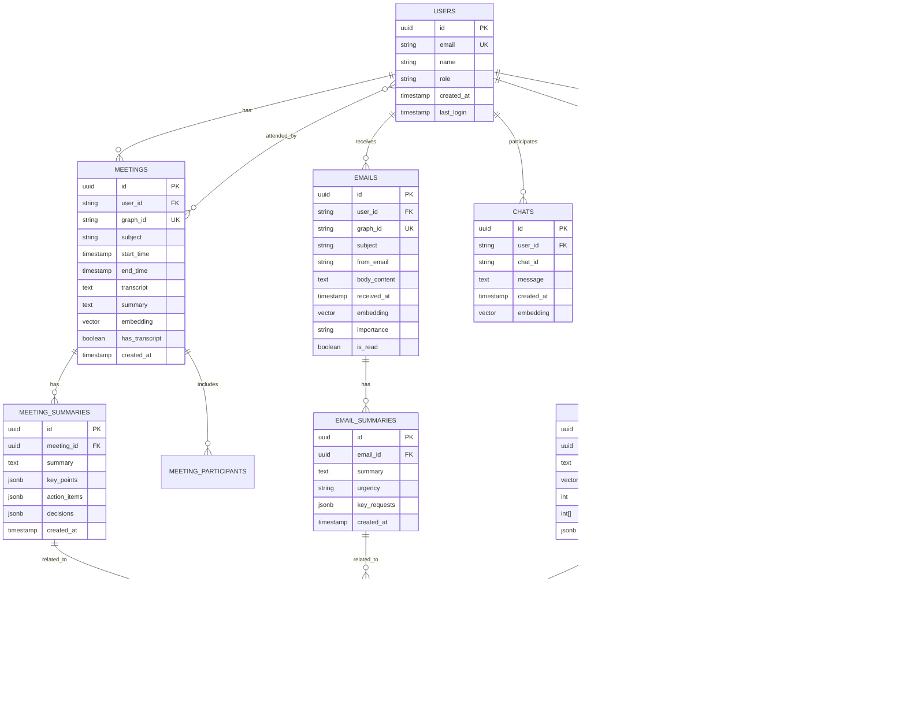

# WorkGraph.ai System Architecture Diagrams

This document contains detailed architecture diagrams for the recommended agentic architecture.

## 1. High-Level System Architecture

## 2. Meeting Preparation Workflow

## 3. Data Flow Architecture

## 4. Security Architecture

## 5. Document Processing Pipeline

## 6. LangGraph Workflow State Machine

## 7. Database Schema (Entity Relationship)

---

## Diagram Usage Notes

1. **Mermaid Diagrams**: All diagrams are written in Mermaid syntax and can be rendered in:
   - GitHub (native support)
   - VS Code (with Mermaid extension)
   - Online editors (mermaid.live)
   - Documentation sites (GitBook, Docusaurus)

2. **Export Options**: 
   - PNG/SVG: Use Mermaid CLI or online tools
   - Interactive: Embed in web pages with mermaid.js
   - Presentations: Export to slides or embed in PowerPoint

3. **Updates**: 
   - Keep diagrams in sync with implementation
   - Version control with git
   - Review during architecture changes

4. **Tools**:
   - Mermaid Live Editor: https://mermaid.live
   - VS Code Extension: Markdown Preview Mermaid Support
   - CLI: `npm install -g @mermaid-js/mermaid-cli`

---

**Created:** February 11, 2026  
**Format:** Mermaid  
**Maintained by:** Development Team
